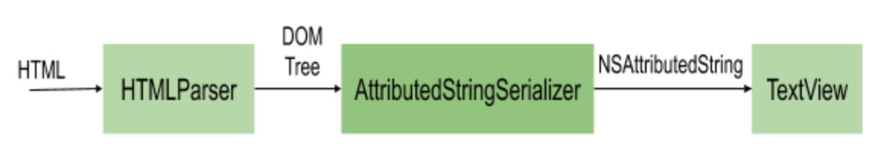
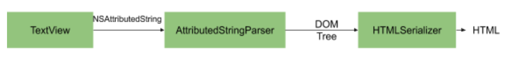

# Introduction

Aztec provides a UI component to display and edit HTML content in a performant way. It does not implement its text layout functionality. Instead, it builds on top of Apple's [UITextView](https://developer.apple.com/documentation/uikit/uitextview) provided by the UIKit framework.  

The library is composed of two main systems:
 - [TextView](https://github.com/wordpress-mobile/AztecEditor-iOS/blob/develop/Aztec/Classes/TextKit/TextView.swift) a user interface component that allows the presentation and editing of the HTML
 - HTML converters that transform raw HTML to [NSAttributedString](https://developer.apple.com/documentation/foundation/nsattributedstring) and vice-versa

You can use each of the components separately, but they are all composed under the TextView class to provide a single element to display and edit HTML.

# TextView

[TextView](https://github.com/wordpress-mobile/AztecEditor-iOS/blob/develop/Aztec/Classes/TextKit/TextView.swift) is the core class of the system. It's a `UITextView` subclass that implements custom subclasses of `NSTextStorage`, `NSLayoutManager`, and `NSAttributeString` attributes to allow HTML editing.

There are two main tasks that this class handles:

 - Maintenance of the custom `NSAttributedString` attributes and attachments as the user edits the content to represent a valid HTML string. 
 - Presentation of the custom attributes, like lists and quotes

The TextView and [TextStorage](https://github.com/wordpress-mobile/AztecEditor-iOS/blob/develop/Aztec/Classes/TextKit/TextStorage.swift) classes are responsible for the maintenance of the `NSAttributedString`. 

They handle user manipulation of formatting (strong, emphasis, lists, blockquotes), embeds (images, videos, separators), and the user interaction with them (line breaks, composition).

The formatting is implemented by the `toggle(formatter, atRange)` method in combination with AttributeFormatter objects. We split the formatter objects into the following categories:
 - [AttributeFormatter](https://github.com/wordpress-mobile/AztecEditor-iOS/blob/develop/Aztec/Classes/Formatters/Base/AttributeFormatter.swift) that handle characters attributes like bold, italic, 
 - [ParagraphAttributedFormatter](https://github.com/wordpress-mobile/AztecEditor-iOS/blob/develop/Aztec/Classes/Formatters/Base/ParagraphAttributeFormatter.swift), that control paragraph attributes like lists, blockquotes, headings, etc.

For embeds, like images, videos, separators, tables, etc we use subclasses of the [NSTextAttachment](https://developer.apple.com/documentation/uikit/nstextattachment) object:
 - [MediaAttachment](https://github.com/wordpress-mobile/AztecEditor-iOS/blob/develop/Aztec/Classes/TextKit/MediaAttachment.swift), 
 - [RenderableAttachment](https://github.com/wordpress-mobile/AztecEditor-iOS/blob/develop/Aztec/Classes/TextKit/RenderableAttachment.swift)

The `replace(at:NSRange, with: NSTextAttachment)` handles the insertion of embeds with multiple helpers methods to handle each specific type of embed.

The attachment objects work by delegating their presentation using the following protocols:
 - [TextViewAttachmentDelegate](https://github.com/wordpress-mobile/AztecEditor-iOS/blob/develop/Aztec/Classes/TextKit/TextView.swift#L7): for media elements where the data can be be downloaded asynchronously from the web. For example `img` and `video` elements.
 - [TextViewAttachmentImageProvider](https://github.com/wordpress-mobile/AztecEditor-iOS/blob/develop/Aztec/Classes/TextKit/TextView.swift#L75): for HTML elements, that have a static presentation like `HR`, HTML comments, `More`, `NextPage`.

Another essential task is interaction with user input and handling new lines, deleting list items, and indents around:
 - Lists
 - Quote
 - Paragraphs

The following "ensure..." methods handle all these scenarios:
 - [ensureRemovalOfParagraphAttributesWhenPressingEnterInAnEmptyParagraph](https://github.com/wordpress-mobile/AztecEditor-iOS/blob/develop/Aztec/Classes/TextKit/TextView.swift#L1945)
 - [ensureInsertionOfEndOfLine](https://github.com/wordpress-mobile/AztecEditor-iOS/blob/develop/Aztec/Classes/TextKit/TextView.swift#L697)
 - [evaluateRemovalOfSingleLineParagraphAttributesAfterSelectionChange](https://github.com/wordpress-mobile/AztecEditor-iOS/blob/develop/Aztec/Classes/TextKit/TextView.swift#L1884)

These methods check if you are adding or removing new paragraphs around lists or quotes and update the attributes accordingly. 

# Presentation of the custom attributes

The [LayoutManager](https://github.com/wordpress-mobile/AztecEditor-iOS/blob/develop/Aztec/Classes/TextKit/LayoutManager.swift) class handles the presentation for the custom attributes that the standard [NSLayoutManager](https://developer.apple.com/documentation/uikit/nslayoutmanager) is unable to do:

 - Backgrounds and vertical bars for Quotes: `drawBlockquotes`
 - Backgrounds for Pre: `drawHTMLPre`
 - List bullets: `drawLists`

The layout manager uses the extra information provided by the [ParagraphStyle](https://github.com/wordpress-mobile/AztecEditor-iOS/blob/develop/Aztec/Classes/TextKit/ParagraphStyle.swift) class to be able to render the correct background and bullets for each element.

# HTML Converter

The [HTMLConverter](https://github.com/wordpress-mobile/AztecEditor-iOS/blob/develop/Aztec/Classes/NSAttributedString/Conversions/HTMLConverter.swift) class handles all the conversation between HTML and NSAttributedString. The main entry points are: 
 - [attributedString(from:html, defaultAttributes)](https://github.com/wordpress-mobile/AztecEditor-iOS/blob/develop/Aztec/Classes/NSAttributedString/Conversions/HTMLConverter.swift#L58), converts from HTML to a NSAttributedString object
 - [html(from:NSAttributedString, pretify)](https://github.com/wordpress-mobile/AztecEditor-iOS/blob/develop/Aztec/Classes/NSAttributedString/Conversions/HTMLConverter.swift#L110) converts from NSAttributedString to HTML

# Converting from HTML to NSAttributedString

Two classes are responsible for the conversion:
 - [HTMLParser](https://github.com/wordpress-mobile/AztecEditor-iOS/blob/develop/Aztec/Classes/Libxml2/Converters/In/HTMLParser.swift) transforms from HTML text to an in-memory XML tree.
 - [AttributedStringSerializer](https://github.com/wordpress-mobile/AztecEditor-iOS/blob/develop/Aztec/Classes/NSAttributedString/Conversions/AttributedStringSerializer.swift) converts from the in-memory tree to NSAttributedString.

The `HTMLParser` class uses the libXML2 library to read the raw HTML. It then transforms the document returned to a more developer-friendly DOM node tree.
The DOM node tree implementation has classes representing elements, text, CSS attributes, CSS values, and comments.
`AttributedStringSerializer` then converts this DOM tree to an NSAttributedString.

The specialized `NSAttributedString` has custom attributes that add extra information about the HTML elements that the string contains:
 - [HTMLRepresentation](https://github.com/wordpress-mobile/AztecEditor-iOS/blob/develop/Aztec/Classes/NSAttributedString/Attributes/HTMLRepresentation.swift) stores the original HTML elements and attributes that were in the initial HTML
 - [ParagraphStyle](https://github.com/wordpress-mobile/AztecEditor-iOS/blob/develop/Aztec/Classes/TextKit/ParagraphStyle.swift) is a subclass on [NSParagraphMutableStyle](https://github.com/wordpress-mobile/AztecEditor-iOS/blob/develop/Aztec/Classes/TextKit/ParagraphStyle.swift), that allows representation of a hierarchy of elements, for example, nested lists, blockquote inside lists, and others.

Specialized [Converter](https://github.com/wordpress-mobile/AztecEditor-iOS/blob/develop/Aztec/Classes/Converters/ElementsToAttributedString/Implementations/GenericElementConverter.swift) classes transform from HTML Elements to NSAttributedString text and attributes, for example:
 - [ImageElementConverter](https://github.com/wordpress-mobile/AztecEditor-iOS/blob/develop/Aztec/Classes/Converters/ElementsToAttributedString/Implementations/ImageElementConverter.swift) converts `img `elements to a custom attachment, 
 - [GenericElementConverter](https://github.com/wordpress-mobile/AztecEditor-iOS/blob/develop/Aztec/Classes/Converters/ElementsToAttributedString/Implementations/GenericElementConverter.swift) transform `strong` elements to a font attribute
 - [LIElementConverter](https://github.com/wordpress-mobile/AztecEditor-iOS/blob/develop/Aztec/Classes/Converters/ElementsToAttributedString/Implementations/LIElementConverter.swift) transform `li` elements from a list to `ParagrahStyle`
 
# Converting NSAttributedString to HTML

In a mirror process from the HTML to NSAttributed conversion, we have the following classes:
 - [AttributedStringParser](https://github.com/wordpress-mobile/AztecEditor-iOS/blob/develop/Aztec/Classes/NSAttributedString/Conversions/AttributedStringParser.swift) converts from the `NSAttributedString` to an in-memory tree
 - [HTMLSerializer](https://github.com/wordpress-mobile/AztecEditor-iOS/blob/develop/Aztec/Classes/Libxml2/Converters/Out/HTMLSerializer.swift) transforms from the in-memory tree to an HTML string.

The `AttributedStringParser` transforms the `NSAttributedString` to a DOM tree. On a first pass, it iterates paragraph by paragraph and uses [StringAttributesConverters](https://github.com/wordpress-mobile/AztecEditor-iOS/blob/develop/Aztec/Classes/Converters/ElementsToAttributedString/Implementations/GenericElementConverter.swift) and [AttachmentConverters](https://github.com/wordpress-mobile/AztecEditor-iOS/blob/develop/Aztec/Classes/Converters/ElementsToAttributedString/Implementations/GenericElementConverter.swift) to convert from `NSStringAttributes` and `NSAttachments` to the DOM. 
Then it goes through the DOM tree and merges nodes to create a simplified version of the tree.

We then use the `HTMLSerializer` to convert the DOM Tree to an HTML string.

