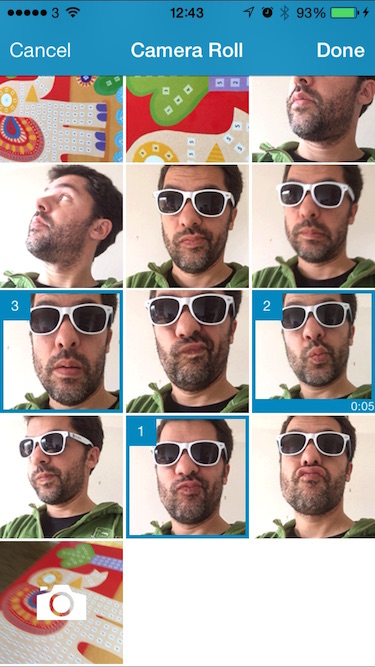

# WPMediaPicker

[](https://travis-ci.org/wordpress-mobile/MediaPicker-iOS)
[](http://cocoadocs.org/docsets/WPMediaPicker)
[](http://cocoadocs.org/docsets/WPMediaPicker)
[](http://cocoadocs.org/docsets/WPMediaPicker)

WPMediaPicker is an iOS controller that allows capture and picking of media assets.
It allows:
 * Multiple selection of media.
 * Capture of new media while selecting
 * Use different data sources for the media library.
 * Selection of groups of media.
 * Filtering by media types.



## Installation

WPMediaPicker is available through [CocoaPods](http://cocoapods.org). To install
it, simply add the following line to your Podfile:

pod "WPMediaPicker"

## Usage

To use the picker do the following:

### Import header

```` objective-c
#import <WPMediaPicker/WPMediaPicker.h>
````

### Create and present WPMediaPickerViewController

```` objective-c
WPMediaPickerViewController * mediaPicker = [[WPMediaPickerViewController alloc] init];
mediaPicker.delegate = self;
[self presentViewController:mediaPicker animated:YES completion:nil];
````

### Implement didFinishPickingAssets delegate

The delegate is responsible for dismissing the picker when the operation completes. To dismiss the picker, call the [dismissViewControllerAnimated:completion:](https://developer.apple.com/library/ios/documentation/uikit/reference/UIViewController_Class/index.html#//apple_ref/occ/instm/UIViewController/dismissViewControllerAnimated:completion:) method of the presenting controller responsible for displaying `WPMediaPickerController` object. Please refer to the demo app.

```` objective-c
- (void)mediaPickerController:(WPMediaPickerViewController *)picker didFinishPickingAssets:(NSArray *)assets
{
  [self dismissViewControllerAnimated:YES completion:nil];  
  // assets contains WPMediaAsset objects.
}
````

### How to configure the appearance of the picker

Just use the standard appearance methods from UIKIT. Here is an example how to configure the main components

```` objective-c
//Configure navigation bar background color
[[UINavigationBar appearanceWhenContainedIn:[WPMediaPickerViewController class],nil] setBarTintColor:[UIColor colorWithRed:0/255.0f green:135/255.0f blue:190/255.0f alpha:1.0f]];
//Configure navigation bar items text color
[[UINavigationBar appearanceWhenContainedIn:[WPMediaPickerViewController class],nil] setTintColor:[UIColor whiteColor]];
//Configure navigation bar title text color
[[UINavigationBar appearanceWhenContainedIn:[WPMediaPickerViewController class],nil] setTitleTextAttributes:@{NSForegroundColorAttributeName: [UIColor whiteColor]} ];
//Configure background color for media scroll view
[[UICollectionView appearanceWhenContainedIn:[WPMediaCollectionViewController class],nil] setBackgroundColor:[UIColor colorWithRed:233/255.0f green:239/255.0f blue:243/255.0f alpha:1.0f]];
//Configure background color for media cell while loading image.
[[WPMediaCollectionViewCell appearanceWhenContainedIn:[WPMediaCollectionViewController class],nil] setBackgroundColor:[UIColor colorWithRed:243/255.0f green:246/255.0f blue:248/255.0f alpha:1.0f]];
//Configure color for activity indicator while loading media collection
[[UIActivityIndicatorView appearanceWhenContainedIn:[WPMediaCollectionViewController class],nil] setColor:[UIColor grayColor]];
````

### How to use the Photos framework instead of the AssetLibrary framework

Before you present the picker do the following:

```` objective-c
self.customDataSource = [[WPPHAssetDataSource alloc] init];
mediaPicker.dataSource = self.customDataSource;
````

### How to use a custom data source for the picker

If you have a custom database of media and you want to display it using the WPMediaPicker you need to to implement the following protocols around your data:

 * [WPMediaCollectionDataSource](Pod/Classes/WPMediaCollectionDataSource.h)
 * [WPMediaGroup](Pod/Classes/WPMediaCollectionDataSource.h)
 * [WPMediaAsset](Pod/Classes/WPMediaCollectionDataSource.h)

You can view the protocols documentation for more implementation details. 
After you have implemented it you can use it by simple doing the following:

```` objective-c
self.customDataSource = [[WPCustomAssetDataSource alloc] init];
mediaPicker.dataSource = self.customDataSource;
````

### Sample Project

To run the example project, clone the repo, and run `pod install` from the Example directory first.

## Requirements

 * ARC 
 * AssetsLibrary, MediaPlayer frameworks and optionally if you are in iOS 8 and above the Photos framework
 * XCode 6
 * iOS 7

## Author

WordPress, mobile@automattic.com

## License

WPMediaPicker is available under the GPL license. See the LICENSE file for more info.

