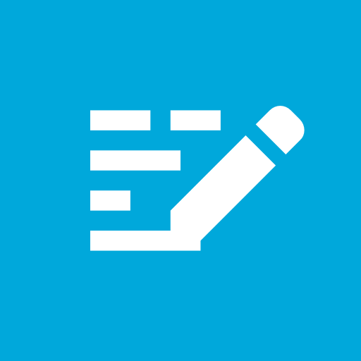

# Aztec for iOS: Native HTML Editor

<p align="center">

</p>

[](https://circleci.com/gh/wordpress-mobile/AztecEditor-iOS)
[](http://cocoapods.org/pods/WordPress-Aztec-iOS)
[](http://cocoapods.org/pods/WordPress-Aztec-iOS)
[](http://cocoapods.org/pods/WordPress-Aztec-iOS)

## About Aztec & WordPressEditor

Aztec is a Swift library that provides a `UITextView` subclass with HTML visual-editing capabilities.

 - Use this library if you want to create an App that interacts with raw HTML content.

WordPressEditor is a Swift library that provides a plugin to make Aztec work with WordPress content.

 - Use this library if you want to create an App that interacts with WordPress HTML content.

## Requirements

- iOS 11 and above
- Xcode 12 and above

## Running the Example App

To run the Example app, you first  open the file `Aztec.xcworkspace` from the root directory of Aztec.

Make sure the `AztecExample` target it selected, and press CMD + R to run it.

## Integrating the Library with Carthage

Both libraries are available through [Carthage](https://github.com/Carthage/Carthage). To install
it, simply add the following line to your Cartfile:

```bash
github "wordpress-mobile/AztecEditor-iOS" "1.0" # or the version number you want
github "wordpress-mobile/WordPressEditor-iOS" "1.0"
```

Follow [these instructions](https://github.com/Carthage/Carthage#getting-started) to add `Aztec.framework` or `WordPressEditor.framework` to your App.

Then:

1. Open your project, head to **Build Settings** for your target and add `$(SDKROOT)/usr/include/libxml2/` to your **Header Search Paths**.
2. Go to `Build Phases` > `Link Binary With Libraries` and add `Aztec.framework`.
3. Add `import Aztec` to your project's source.

## Integrating the Library with CocoaPods

Both libraries are available through [CocoaPods](http://cocoapods.org). To install
them, simply add the following lines to your Podfile:

```bash
pod "WordPress-Aztec-iOS", "1.0" # or the version number you want
pod "WordPress-Editor-iOS", "1.0"
```

## Usage

After installing Aztec, import the module and use the `Aztec.TextView` view as shown below:

```swift
import Aztec

// ...

let textView = Aztec.TextView(
    defaultFont: UIFont,
    defaultParagraphStyle: ParagraphStyle = ParagraphStyle.default,
    defaultMissingImage: UIImage) {
```

## Contributing

Read our [Contributing Guide](CONTRIBUTING.md) to learn about reporting issues, contributing code, and more ways to contribute.

## Getting in Touch

If you have questions about getting setup or just want to say hi, join the [WordPress Slack](https://chat.wordpress.org) and drop a message on the `#mobile` channel.

## License

AztecEditor-iOS and WordPress-Editor-iOS are open source projects covered by the [Mozilla Public License Version 2.0](LICENSE.md).
